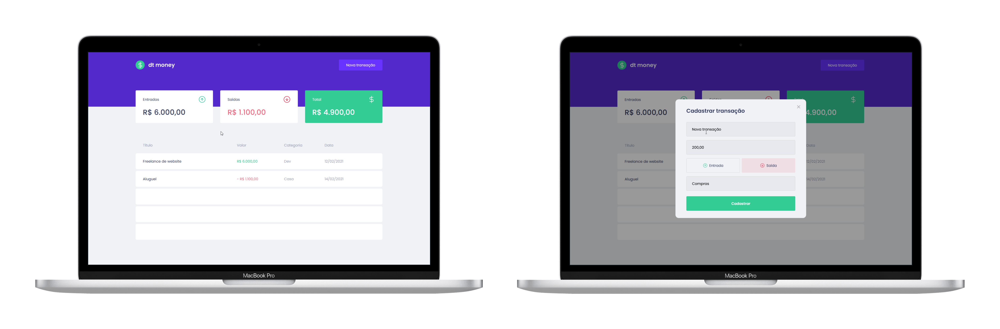

<p align="center">
    
</p>

# Ignite Project 02
Simple transactions CRA application idea made during Ignite ReactJS

## 🔨 Features

→ Styled Components

→ React Modal Library

→ Context API

→ Custom Hook

→ Fake API utilizando [**MirageJS**](https://miragejs.com/)

## 🚀 Techs & Tools
→ [**ReactJS**](https://reactjs.org/)

→ [**TypeScript**](https://www.typescriptlang.org/)

→ [**MirageJS**](https://miragejs.com/)

→ [**NextAuth.js**](https://next-auth.js.org)

## 💻 Installation
```bash
# Open terminal and clone this repository
$ git clone https://github.com/luizwhite/iliketomoveit-nextjs-nlw04.git

# Install dependencies
$ yarn

# Start the application
$ yarn start
```